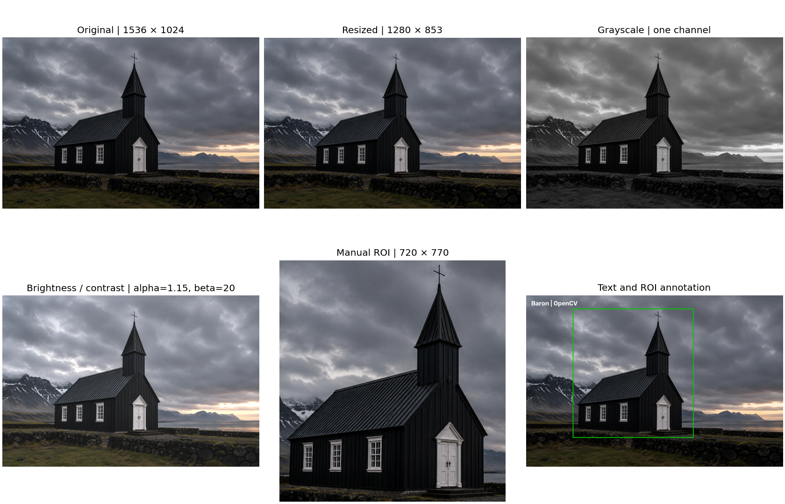
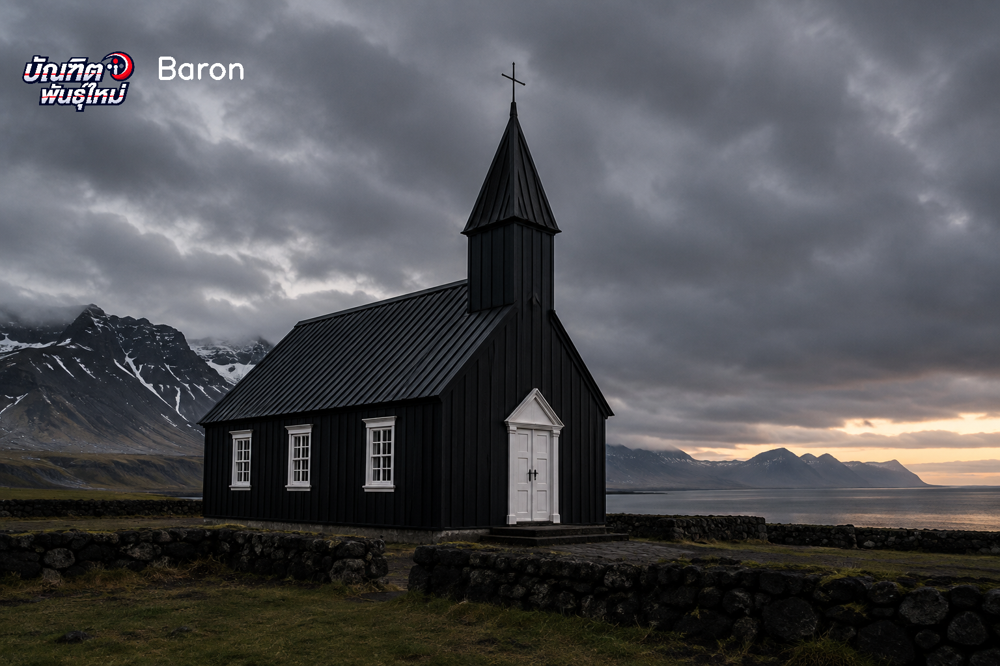

# OpenCV Image Processing

A Python image-processing project using a church image from coursework.
The notebook loads the source, applies five transformations and saves a comparison grid.



## What it does

| Operation | Result for the bundled image |
| --- | --- |
| Load and inspect | 1536 × 1024 pixels; three BGR channels |
| Resize with aspect ratio preserved | 1280 × 853 pixels |
| Convert to grayscale | One intensity channel |
| Adjust brightness and contrast | `alpha=1.15`, `beta=20` |
| Crop a manual region of interest | 720 × 770 pixels |
| Add annotations | ROI rectangle and `Baron \| OpenCV` text |
| Save results | Five processed PNGs and a comparison grid |

The crop uses manually chosen coordinates; the project does not perform automatic
object detection. OpenCV's BGR images are converted to RGB before Matplotlib display.

## Run the notebook

1. Download or clone the repository and open its folder.
2. Keep `OpenCV_Image_Processing.ipynb` and `church.png` in that same folder.
3. If needed, install dependencies from a terminal in the project folder:

   ```bash
   python3 -m pip install -r requirements.txt
   python3 -m notebook
   ```

4. Open `OpenCV_Image_Processing.ipynb` in Jupyter and use **Restart Kernel and Run All**.
5. Review the figures and the images in `outputs/`.

If you already have a working Jupyter environment with OpenCV, NumPy and Matplotlib,
you can open the notebook there directly. The code uses inline plots and does not
need `cv2.imshow` or a desktop image window.

## Files

- `OpenCV_Image_Processing.ipynb` — notebook with executed outputs and explanations.
- `church.png` — input image used by the pipeline.
- `outputs/` — regenerated images and the comparison grid.
- `requirements.txt` — dependencies for a fresh environment.
- `VALIDATION.md` — tested versions, checks and observed results.
- `final_church_image.png` — earlier coursework output with a name and logo overlay.

## Earlier coursework output



This image is included separately for context. The new notebook generates its own
text and rectangle annotation; it does not recreate this logo overlay.

## Development and learning

This new portfolio notebook was rebuilt with AI assistance using the supplied
coursework image. All code cells were executed in order, the saved PNGs were
reloaded and checked, and the original source image was preserved.

Useful practice changes are adjusting the brightness parameters, choosing another
ROI and changing the annotation text. See `VALIDATION.md` for the exact environment
and checks. Review and adapt the code before describing it in an interview.

Author: **Thu Kha Pyeit Sone Kyaw (Baron)** · [GitHub](https://github.com/baronkyaw)

References: [OpenCV image operations](https://docs.opencv.org/4.x/d3/df2/tutorial_py_basic_ops.html)
and [OpenCV drawing functions](https://docs.opencv.org/4.x/dc/da5/tutorial_py_drawing_functions.html).
